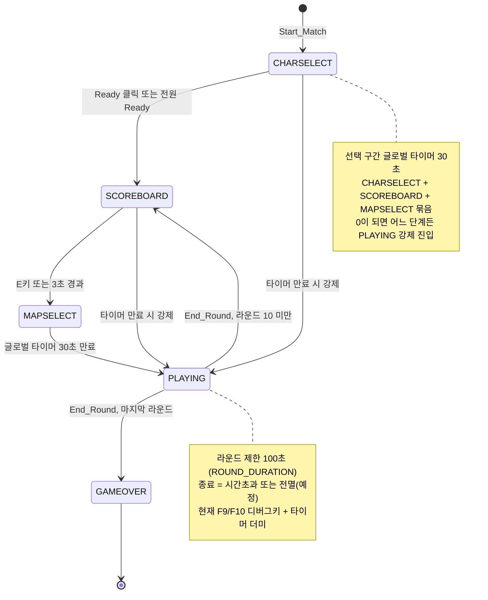
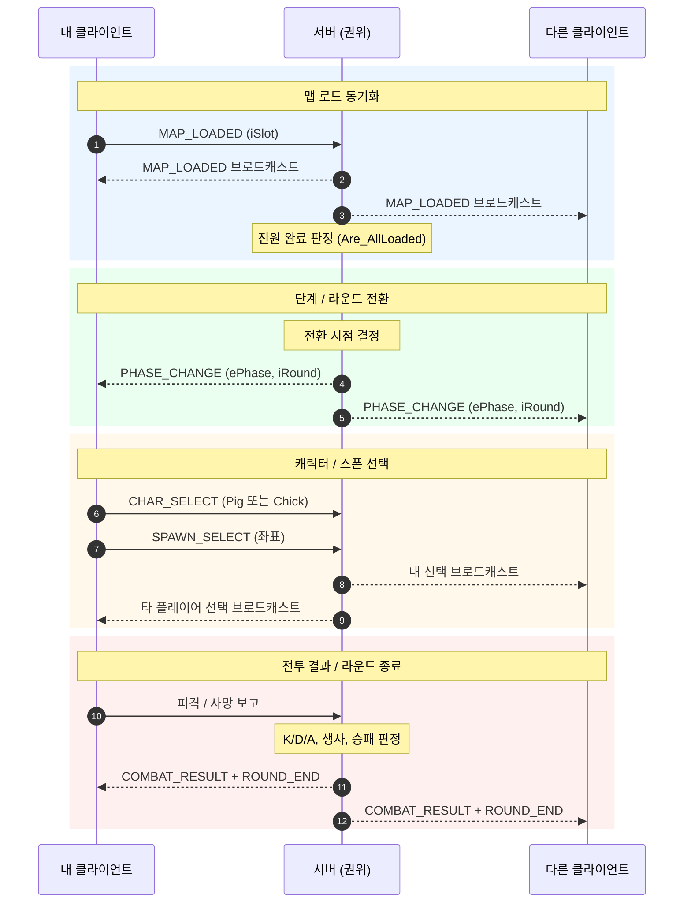
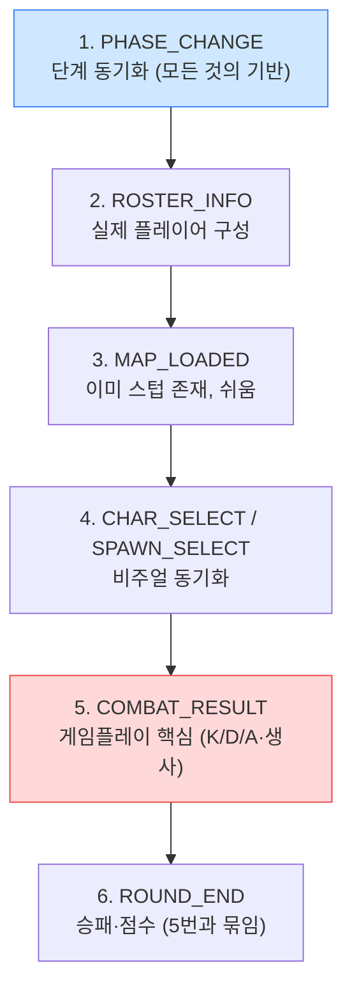

# Game_Manager 네트워크 동기화 정리

> 범위: `CGame_Manager` (게임 시작 이후의 라운드 진행). 방 생성/입장(로비)은 이미 `NetworkClient`의 `MATCH_WAIT / MATCH_SUCCESS`로 처리되므로 제외.

---

## 0. 핵심 진단 & 권한 모델

현재 `Game_Manager`는 **전부 로컬/더미**로 동작한다.

- `Setup_DummyPlayers()`가 가짜 6명을 생성한다.
- 모든 단계 전환을 각 클라이언트가 **자기 타이머로 독립 판단**한다.
- 라운드 종료는 `F9 / F10` 디버그키 + 타이머 만료 더미다.
- 생존/사망은 `Refresh_HUD()`에서 `bAlive = true` 고정 더미다.

→ 멀티플레이 전환의 본질은 **게임 상태를 서버 권위(server-authoritative)로 옮기고, 단계·점수·전투 결과를 브로드캐스트**하는 것이다.

**역할 분담**

| 주체 | 소유(권위) |
|------|-----------|
| **서버** | 단계(`m_ePhase`), 라운드(`m_iRound`), 점수(`m_iTeamScore`), K/D/A, 생사, 라운드 시작/종료 판정 |
| **클라이언트** | 본인 입력/이동/조준, 본인 캐릭터 선택, 본인 스폰 선택 (→ 서버로 보고) |

> 본인 이동/조준은 이미 `NetworkClient::Send_Move()`로 처리됨 → **Game_Manager 범위 밖**.

---

## 1. 단계 흐름 & 상태

라운드는 `CHARSELECT → SCOREBOARD → MAPSELECT(=PHASE_SHOP) → PLAYING` 순으로 진행되며, 총 10라운드 후 `GAMEOVER`로 끝난다. `CHARSELECT + SCOREBOARD + MAPSELECT`는 **하나의 30초 글로벌 타이머**(`SELECT_TOTAL_DURATION`)로 묶여 있고, 0이 되면 어느 단계에 있든 `PLAYING`으로 강제 진입한다.

> `MAPSELECT`는 내부적으로 `PHASE_SHOP` 단계다. 현재 `USE_SHOP = false`라서 상점 대신 스폰 위치 선택 창으로 동작한다.

**문제점:** 위 전환 조건(Ready 클릭, E키, 각 타이머)이 **클라이언트마다 따로** 평가된다. 멀티에서는 같은 순간에 모두 같은 단계여야 하므로, 전환 판정을 **서버가 단독으로 하고 결과만 브로드캐스트**해야 한다.

---

## 2. 서버 ↔ 클라이언트 동기화 방향

**방향 표기**

- `S→ALL` : 서버가 전체에 브로드캐스트 (상태 권위)
- `C→S` : 클라이언트가 서버로 보고
- `C→S→ALL` : 클라 보고 → 서버 갱신 → 전체 브로드캐스트

---

## 3. 동기화 포인트 종합표

| # | 항목 | 핵심 상태/변수 | 방향 | 트리거 | 현재 상태 |
|---|------|----------------|------|--------|-----------|
| 1 | **단계·라운드 진행** | `m_ePhase`, `m_iRound`, 각 타이머 | `S→ALL` | 서버가 전환 시점 결정 | 클라 독립 판단 |
| 2 | **매치 로스터** | `m_vStats` (slot/team/name/money) | `S→ALL` | 매치 시작 시 1회 | `Setup_DummyPlayers` 더미 |
| 3 | **맵 로드 완료** | `bMapLoaded` | `C→S→ALL` | 각 클라 로드 종료 | 스텁 존재 (`Notify_MapLoaded`) |
| 4 | **캐릭터 선택** | `m_iCSMyCharacter` (0=Pig/1=Chick) | `C→S→ALL` | 캐릭터 칸 클릭 | 로컬만 |
| 5 | **스폰 선택** | MapSelect 선택 좌표 | `C→S→ALL` | 맵 클릭 | 로컬만 |
| 6 | **전투 결과** | `iKill/iDeath/iAssist`, 생사 | `C→S→ALL` | 피격/사망 발생 | 더미 (`bAlive=true`) |
| 7 | **라운드 승패** | `End_Round()`, `m_iTeamScore[2]` | `S→ALL` | 전멸 또는 시간초과 | F9/F10 디버그키 |
| 8 | **게임 종료** | `GAMEOVER` 전환 | `S→ALL` | 마지막 라운드 종료 | 점수에서 자동 도출 |

---

## 4. 동기화 포인트 상세

### 1) 단계·라운드 진행 — 최우선
- **상태:** `m_ePhase`, `m_iRound`, 그리고 `m_fSelectTimer / m_fScoreboardTimer / m_fRoundTimer / m_fShopTimer`
- **방향:** `S→ALL`
- **트리거:** 서버가 전환 시점 결정
- **처리:** `Enter_Phase()`를 **자체 판단이 아니라 서버의 `PHASE_CHANGE` 패킷 수신 시** 호출하도록 변경. 타이머는 서버 기준 시각을 공유하거나, 서버는 전환 이벤트만 던지고 클라는 표시(카운트다운)용으로만 굴린다.

### 2) 매치 로스터 (Start_Match)
- **상태:** `m_vStats` — 각 항목의 `iSlot / iTeam / strName / iMoney`
- **방향:** `S→ALL` (매치 시작 시 1회)
- **트리거:** 매치 성사 직후
- **처리:** `Setup_DummyPlayers()`를 **서버에서 받은 실제 로스터**로 구성. 6명 전원의 팀/번호/이름이 서버에서 와야 한다.

### 3) 맵 로드 완료 — 이미 절반 설계됨
- **상태:** `bMapLoaded`
- **방향:** `C→S→ALL`
- **트리거:** 각 클라이언트가 라운드 맵 로드 완료
- **처리:** 이미 `Notify_MapLoaded(iSlot)`, `Are_AllLoaded()`, `Force_AllLoaded()` 스텁이 존재하고 주석에도 "네트워크용"이라 적혀 있다. 각 클라가 로드 완료를 서버에 통지 → 서버 브로드캐스트 → 수신 측에서 `Notify_MapLoaded` 호출. 전원 완료 시 SCOREBOARD 종료.

### 4) 캐릭터 선택 (CHARSELECT)
- **상태:** `m_iCSMyCharacter` (0=Pig / 1=Chick), `m_bCSReady`
- **방향:** `C→S→ALL`
- **트리거:** 캐릭터 칸 클릭 / Ready 클릭
- **처리:** 내 선택을 서버로 보내고 타 플레이어 선택을 수신. **인게임에서 옆 플레이어를 올바른 모델(Pig/Chick)로 그리려면 필수.** `m_bCSReady`는 전원 Ready 또는 타임아웃 판정용(전환 자체는 결국 1번으로 귀결).

### 5) 스폰 위치 선택 (MAPSELECT 단계)
- **상태:** `m_pMapSelect`의 선택 좌표 (`Get_SelectedWorld`)
- **방향:** `C→S→ALL`
- **트리거:** 맵에서 스폰 지점 클릭
- **처리:** 내 스폰을 서버로, 타 플레이어 스폰을 수신. `Apply_SpawnLaunch()`의 포물선 발사가 모두에게 동시에 일어나야 자연스럽다(발사 트리거 + 목표 좌표 동기화).

### 6) 전투 결과 (PLAYING) — 데이터 가장 많음
- **상태:** `m_vStats[i].iKill / iDeath / iAssist`, 라운드별 생존 플래그
- **방향:** `C→S→ALL`
- **트리거:** 피격 / 사망 발생
- **처리:**
  - **K/D/A:** 킬 발생 시 서버가 갱신 후 브로드캐스트 → 스코어보드(`Refresh_Scoreboard`)·HUD 반영.
  - **생존/사망:** 현재 `Refresh_HUD()`가 `bAlive = true` 더미(코드에 TODO). 라운드별 실제 생존 플래그를 서버가 관리·브로드캐스트해야 HUD 박스 색(흰=생존/검=사망)이 맞는다.
  - **무기 선택:** `Set_Weapon()`이 현재 로컬이라 남의 무기가 안 보임. `USE_SHOP = false`인 동안은 후순위.

### 7) 라운드 종료·승패 (End_Round)
- **상태:** `End_Round(iWinnerTeam)`, `m_iTeamScore[2]`
- **방향:** `S→ALL`
- **트리거:** 전멸 또는 라운드 시간초과
- **처리:** 현재 F9/F10 + 타이머 만료 더미. 실제로는 **서버가 생존 인원 기반으로 승패를 판정**하고 결과를 전송. `m_iTeamScore`를 서버 값으로 갱신해야 스코어보드/HUD가 일치한다.

### 8) 게임 종료 (GAMEOVER)
- **상태:** `GAMEOVER` 전환
- **방향:** `S→ALL`
- **트리거:** 마지막(10) 라운드 종료
- **처리:** 전환 자체만 동기화하면 된다. 최종 승자는 이미 동기화된 `m_iTeamScore`에서 자동 도출.

---

## 5. 추가가 필요한 패킷 / 이벤트 타입

현재 `NetworkClient::NetEventType`에는 `PLAYER_ADD / PLAYER_REMOVE / PLAYER_MOVE / MATCH_WAIT / MATCH_SUCCESS`만 있다. 위 항목들을 위해 다음을 추가해야 한다.

| 이벤트 타입(제안) | 방향 | 담는 데이터 | 대응 항목 |
|------------------|------|-------------|-----------|
| `ROSTER_INFO` | `S→ALL` | 6명의 slot/team/name | #2 |
| `PHASE_CHANGE` | `S→ALL` | ePhase, iRound, (서버 타이머) | #1 |
| `MAP_LOADED` | `C→S→ALL` | iSlot | #3 |
| `CHAR_SELECT` | `C→S→ALL` | iSlot, character | #4 |
| `SPAWN_SELECT` | `C→S→ALL` | iSlot, 좌표 | #5 |
| `COMBAT_RESULT` | `C→S→ALL` | iSlot, K/D/A, 생사 | #6 |
| `ROUND_END` | `S→ALL` | iWinnerTeam, teamScore | #7 |

---

## 6. 우선순위 로드맵

1. **단계 동기화(`PHASE_CHANGE`)** — 나머지 전부의 기반. 여기부터.
2. **로스터(`ROSTER_INFO`)** — 더미 6명을 실제 플레이어로 교체.
3. **맵 로드(`MAP_LOADED`)** — 스텁이 이미 있어 연결만 하면 됨.
4. **캐릭터/스폰 선택** — 인게임 비주얼 정합.
5. **전투 결과(`COMBAT_RESULT`)** — 게임플레이의 핵심.
6. **라운드 승패(`ROUND_END`)** — 5번과 함께 마무리.
