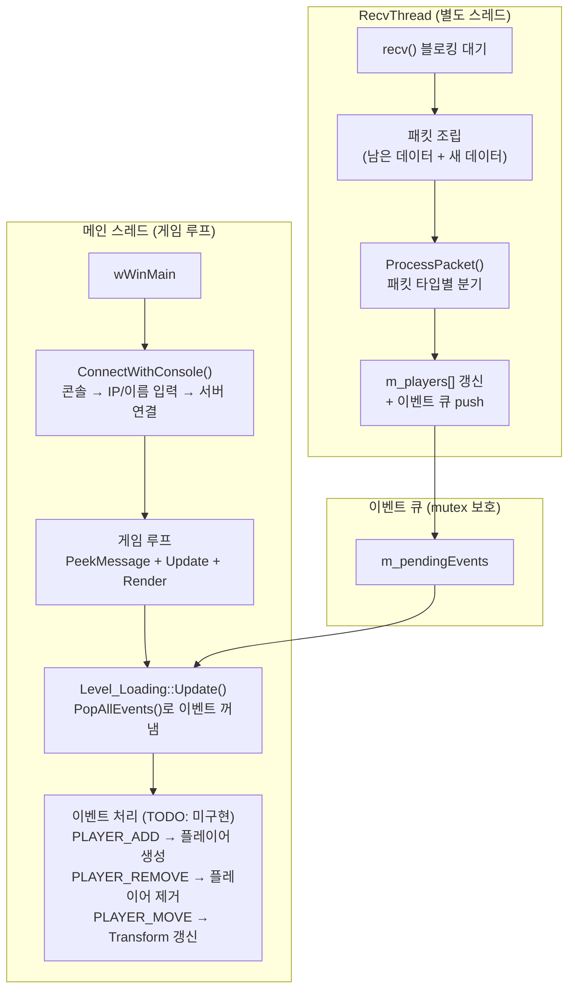
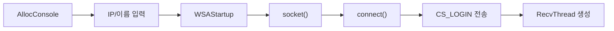
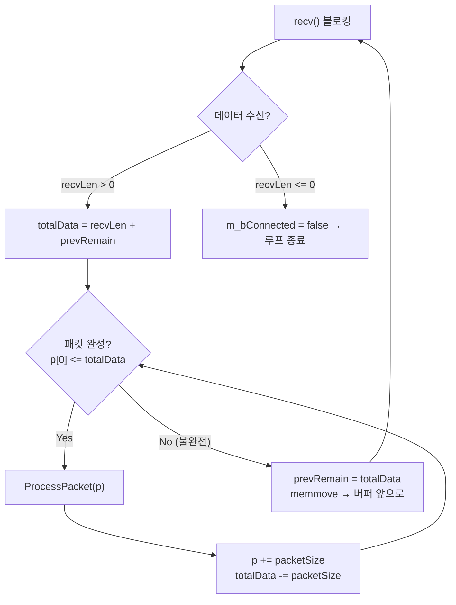
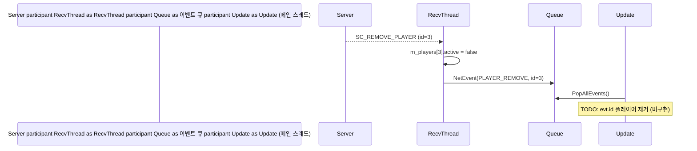
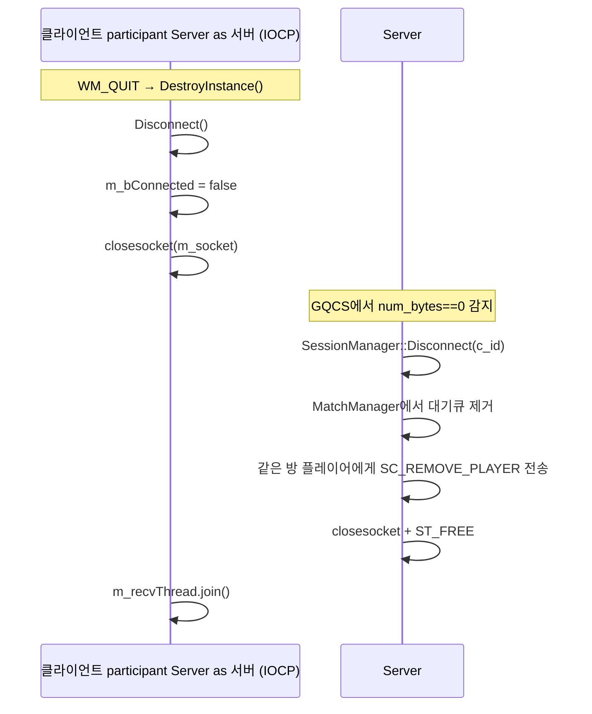

# NetworkClient 동작 원리

## 1. 전체 구조 다이어그램

---

## 2. 단계별 동작

### ① 접속 단계 (ConnectWithConsole)

메인 스레드에서 실행됩니다. 서버와 TCP 연결 후 로그인 패킷을 보내고, 수신 전담 스레드를 하나 띄웁니다.

### ② 수신 스레드 (RecvThread)

**핵심**: TCP는 스트림이라 패킷이 잘려서 올 수 있습니다.  
`p[0]`(첫 바이트 = size)을 보고 완전한 패킷만 처리하고, 나머지는 `prevRemain`에 보관했다가 다음 `recv()`와 합칩니다.

### ③ 패킷 처리 (ProcessPacket)

| 패킷 | 동작 |
|---|---|
| `SC_LOGIN_INFO` | 내 id/위치 저장, `m_players[]` 갱신 → `PLAYER_ADD` 이벤트 push, `m_bLoggedIn = true` |
| `SC_MATCH_WAIT` | `m_iQueueSize` 갱신 → `MATCH_WAIT` 이벤트 push |
| `SC_MATCH_SUCCESS` | `m_iRoomId` 저장, `m_bMatched = true` → `MATCH_SUCCESS` 이벤트 push |
| `SC_ADD_PLAYER` | `m_players[]` 갱신 (위치/이름/active) → `PLAYER_ADD` 이벤트 push |
| `SC_REMOVE_PLAYER` | `m_players[]` 비활성화 (`active = false`) → `PLAYER_REMOVE` 이벤트 push |
| `SC_MOVE_PLAYER` | `m_players[]` 위치/look/keyInput 갱신 → `PLAYER_MOVE` 이벤트 push |

### ④ 이벤트 큐 (스레드 간 통신)

RecvThread ──push_back──► m_pendingEvents ◄──swap + clear── 메인 스레드(Update) (m_eventLock mutex 보호)

DirectX 리소스는 메인 스레드에서만 접근해야 하므로, RecvThread는 **데이터만 큐에 넣고**,  
실제 게임 오브젝트 생성/삭제는 **메인 스레드의 `Update()`에서 `PopAllEvents()`로 꺼내서 처리**합니다.

`PopAllEvents()`는 `outEvents.swap(m_pendingEvents)` 후 `m_pendingEvents.clear()`를 호출하여,  
호출자가 이전에 갖고 있던 데이터가 큐에 남지 않도록 합니다.

### ⑤ 송신 (Send, Send_Move)

메인 스레드 (키 입력/게임 로직) → Send_Move() → Send() → ::send() → 서버

송신은 별도 스레드 없이 메인 스레드에서 직접 `::send()`를 호출합니다.  
TCP이므로 작은 패킷은 블로킹 없이 바로 전송됩니다.

### ⑥ 종료 (Disconnect)

m_bConnected = false → m_bLoggedIn = false → m_bMatched = false → closesocket() → recv() 에러 리턴 → RecvThread 루프 탈출 → m_recvThread.join() 대기

소켓을 먼저 닫아서 `recv()`가 에러를 리턴하게 만들고, `join()`으로 스레드가 완전히 종료될 때까지 기다립니다.  
※ `Disconnect()`에서 로그아웃 패킷은 전송하지 않습니다. (서버 측에서 소켓 종료 감지 시 `GQCS` 에러 → `SessionManager::Disconnect()` 호출)

---

## 3. 두 스레드의 역할 분담

| | 메인 스레드 | RecvThread |
|---|---|---|
| **하는 일** | 게임 루프, 렌더링, 오브젝트 관리, 패킷 송신 | 패킷 수신, 데이터 파싱, `m_players[]` 갱신 |
| **DirectX 접근** | ✅ | ❌ |
| **이벤트 큐** | `PopAllEvents()`로 소비 (swap + clear) | `push_back()`으로 생산 |
| **동기화** | `m_eventLock`으로 큐 접근 | `m_eventLock`으로 큐 접근, `m_lock`으로 `m_players[]` 접근 |

---

## 4. PLAYER_REMOVE 동작 흐름

> ⚠️ 현재 `Level_Loading::Update()`의 `PLAYER_REMOVE` 케이스는 `// TODO` 상태입니다.  
> `PLAYER_ADD`, `PLAYER_MOVE`도 마찬가지로 미구현 상태입니다.

---

## 5. 로그아웃 흐름

> ⚠️ 현재 클라이언트에 `Send_Logout()` 함수는 존재하지 않습니다.  
> 클라이언트는 소켓을 닫는 것으로 종료하며, 서버는 IOCP에서 연결 끊김을 감지하여 `Disconnect()`를 호출합니다.  
> 서버 측에서 `CS_LOGOUT` 패킷을 처리하는 코드는 존재하지만(`SessionManager::ProcessPacket`), 클라이언트에서 이를 보내는 로직은 아직 없습니다.