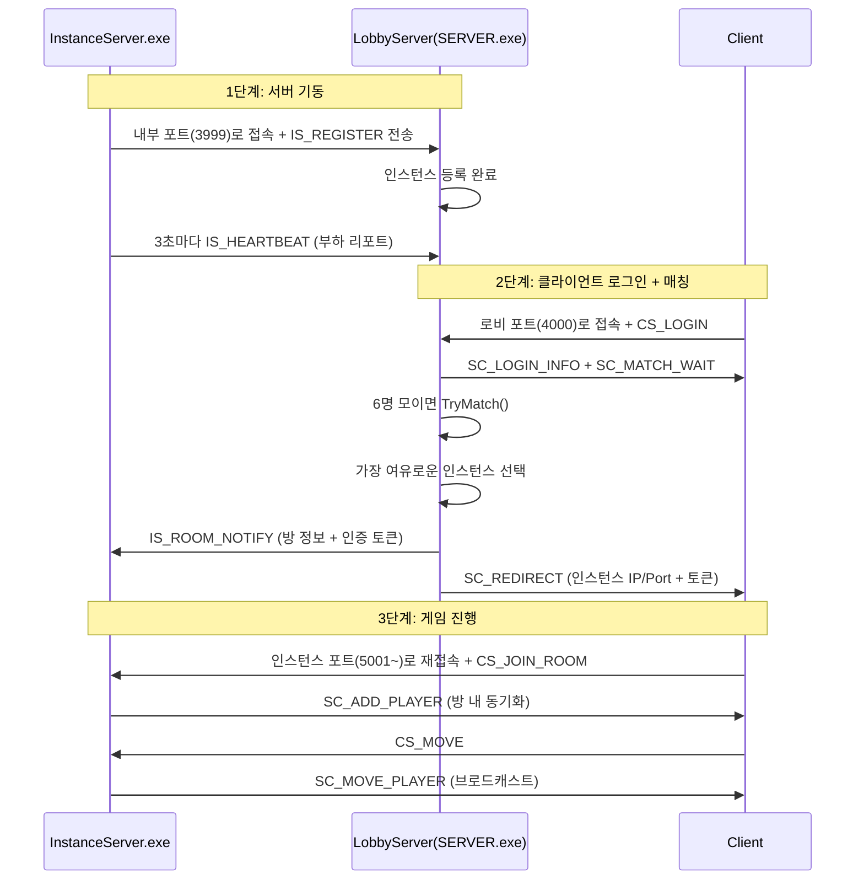
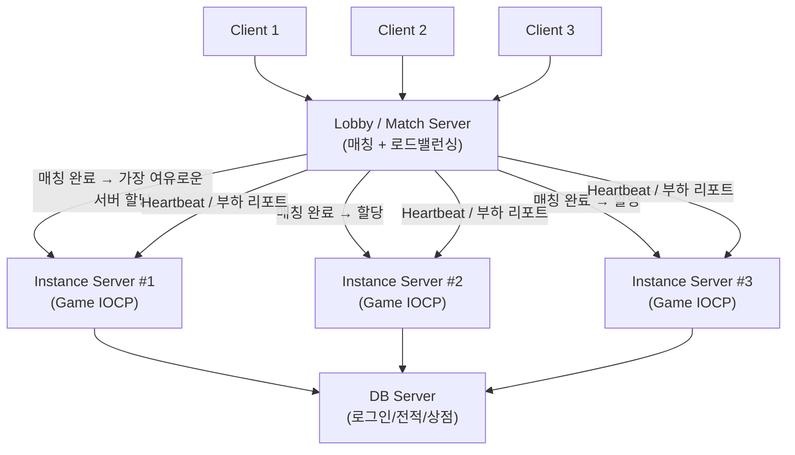
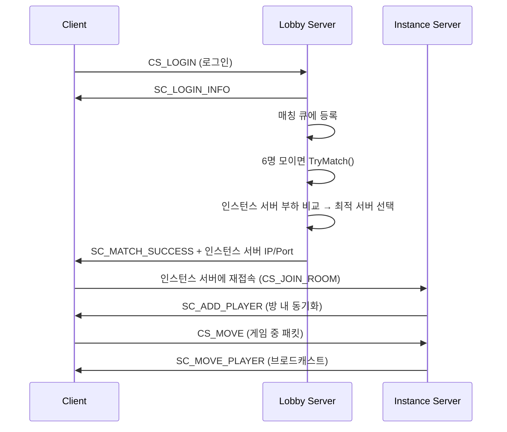

# 전체 서버 구조

# 로드 밸런싱 + 매칭

## 흐름도

## 사용법

### 1번째: 로비 서버 먼저 실행
SERVER.exe

### 2번째~: 인스턴스 서버를 각각 다른 창에서 실행
InstanceServer.exe 0 5001 127.0.0.1\
InstanceServer.exe 1 5002 127.0.0.1\
InstanceServer.exe 2 5003 127.0.0.1

## 사용법2

배치 파일로 실행